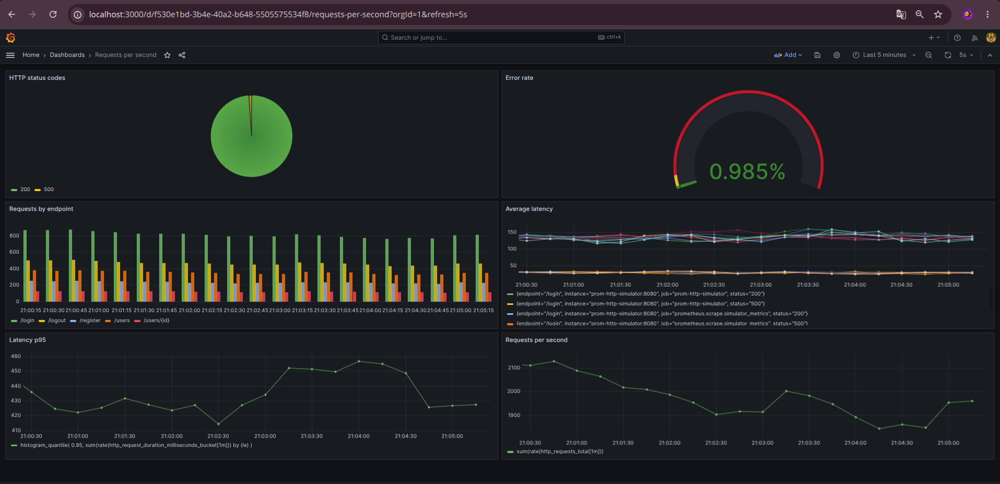

# Desafio Técnico em DevOps: Stack de Monitoramento e Observabilidade

Projeto desenvolvido como solução para um desafio técnico de DevOps

## Objetivo

Este projeto para um desafio técnico em DevOps mostra o desenvolvimento de uma stack de software para observabilidade utilizando como ferramentas
o **Docker Compose** para orquestrar contêineres com ambientes contendo **Prometheus**, **Grafana**, **Grafana Alloy** e **simulador de aplicações HTTP**. O objetivo é coletar, armazenar e visualizar métricas em tempo real por meio de dashboards de monitoramento.

## Arquitetura do projeto

O HTTP Simulator expõe métricas por meio do endpoint `/metrics`. O Grafana Alloy realiza periodicamente a coleta (scrape) dessas métricas e as encaminha ao Prometheus utilizando o protocolo Remote Write. Por fim, o Grafana consulta o Prometheus através de consultas PromQL para construir os dashboards de monitoramento.

```text
HTTP Simulator
      │
      │ (/metrics)
      ▼
 Grafana Alloy
      │
      │ Remote Write
      ▼
  Prometheus
      │
      │ PromQL
      ▼
    Grafana
```

## Tecnologias

| Tecnologia | Função |
|------------|--------|
| Docker Compose | Orquestração dos containers |
| Prometheus | Armazenamento e consulta das métricas|
| Grafana | Visualização das métricas |
| Grafana Alloy | Coleta (scrape) das métricas |
| HTTP Simulator | Simulação de requisições HTTP |

## Estrutura do projeto

```text
.
├── alloy/
├── grafana/
│   └── dashboards/
│       └── dashboards.json
    └── img/
        └── img.png
├── prometheus/
├── docker-compose.yml
├── .env.example
└── README.md

```

### alloy/

Aqui temos uma pasta contendo um arquivo para as configurações do Grafana Alloy, agente para raspagem de dados.

### prometheus 

Da mesma forma, temos uma pasta para guardar o arquivo de configurações do prometheus em .yml.

### docker-compose.yaml 

Coração da aplicação, orquestração de containers e configurações docker.

### .env.example 

Arquivo .env para guardar informações sensíveis e variáveis de ambiente.

### README.md

Documentação do projeto.

## Como executar

Os pré-requisitos são: Ter instalado na máquina o Docker, Docker Compose e o Git.

1. Clonando repositório

```bash
git clone https://github.com/Cassio3103/Desafio-Tecnico-DevOps.git

cd Desafio-Tecnico-DevOps
```

2. Iniciando ambiente 

```bash
docker compose up -d
```

3. Verificando containers 

```bash
docker ps
```

- Todos os containers devem estar com status Up e, quando aplicável, Healthy.

### Parando a aplicação

```bash
docker compose down
```

## Acessando os serviços

### Grafana

- http://localhost:3000

Login utilizando as credenciais definidas no arquivo .env.

### Prometheus

- http://localhost:9090

### HTTP Simulator

- http://localhost:8080

## Importando o Dashboard

1. Acesse Grafana.
2. Vá em Dashboards → New → Import.
3. Selecione `grafana/dashboards/dashboards-desafio-devops.json`.
4. Escolha a fonte de dados Prometheus.
5. Clique em Import.

## Resultados

Abaixo é apresentado o dashboard desenvolvido para monitoramento das métricas coletadas pelo Grafana Alloy e armazenadas no Prometheus.

<p align="center">
  
</p>

## Decisões técnicas

- Optou-se pela utilização do Grafana Alloy como agente responsável pelo scrape das métricas, encaminhando-as ao Prometheus por meio do protocolo Remote Write. Essa abordagem separa a responsabilidade de coleta da responsabilidade de armazenamento e consulta das métricas.

- Arquivos .env para armazenar informações sensíveis e variáveis de ambiente da aplicação.

- Projeto definido em diretórios para melhor visualização da arquitetura.

- Rede de containers personalizada para garantir persistência dos dados da aplicação.

- Implementação de healthchecks para monitorar a disponibilidade dos serviços e facilitar sua manutenção durante a execução da aplicação.

## Futuras possíveis melhorias

### Observações de desenvolvimento

Durante o desenvolvimento foram realizados diversos testes de configuração entre o Prometheus e o Grafana Alloy. Para preservar o ambiente e os dashboards criados, optou-se por manter os dados históricos armazenados no volume do Prometheus. Como consequência, algumas métricas podem apresentar séries provenientes de configurações anteriores. Em um ambiente de produção ou em uma entrega definitiva, bastaria recriar o volume do Prometheus para iniciar a coleta com um banco de dados limpo.

- Adição da métrica de containers.
- Pipeline CI/CD para deploy automático.


